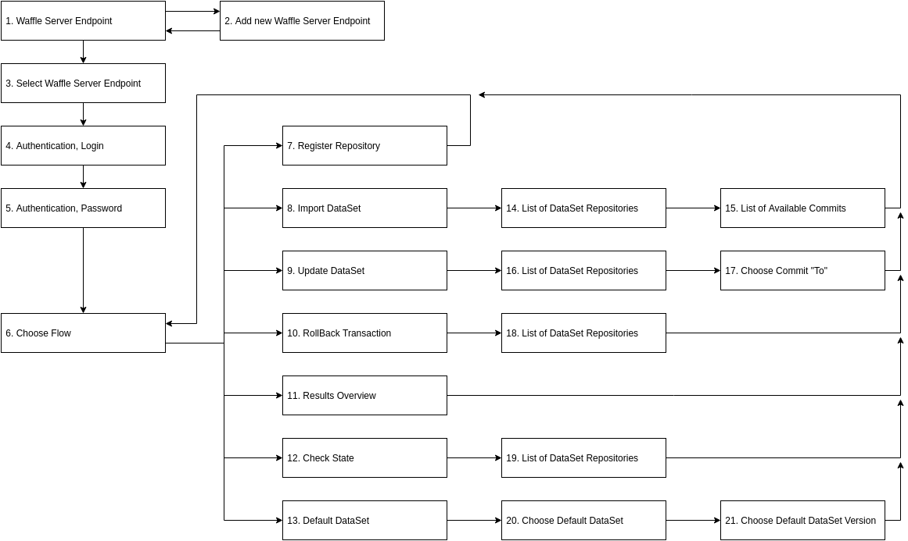

# Waffle Server import CLI Tool

## Installation

Make sure you have node.js (version 4.x.x or higher) installed on your computer.

```bash
    npm i -g waffle-server-import-cli
```

### SSH-key

**Skip this step if you already have ssh-key registered in GitHub**

Cli-tool works with github repositories by SSH. So, ssh-key should be added and configured in your Environment for appropriate usage.

`Windows users`: do following with `git-cli` terminal.

- check that you haven't key: `ls -al ~/.ssh`
- generate new one: `ssh-keygen -t rsa -b 4096 -C "your_email@example.com"` (**keep `password` empty**)
- add your key to ssh-agent: `eval "$(ssh-agent -s)"` and `ssh-add ~/.ssh/id_rsa`
- add it to your GitHub account. Past it into `Settings/SSH and GPG keys`.
- test connection: `ssh -T git@github.com`

More details available [here](https://help.github.com/articles/generating-an-ssh-key/)

## Usage

Launch tool with following command.

```bash
    ws-cli
```

## Use Cases




## Tool Options Overview

### 1. Waffle Server Endpoint

#### - Select from the List;
If endpoint already added through cli tool.

#### - Add new Endpoint
If new endpoint should be added into cli tool.


### 2. Add new Waffle Server Endpoint

Type new endpoint and it becomes available in the List.

*Example of Input value:* `http://localhost:3000`


### 3. Select Waffle Server Endpoint

Endpoint should be chosen from the list of reserved endpoints.
If there is no URL you need, back to previous Option and select **Add new Endpoint**.


### 4. Authentication, Login

Type User Login, provided by Waffle Server Administrator


### 5. Authentication, Password

Type User Password, provided by Waffle Server Administrator


### 6. Choose Flow

It is main list of Options in the Tool. It describes all available functionality to work with DataSets.


### 7. Register Repository

Type new Git Repository URL and it becomes available in the Tool.

*Example of Input value:* `git@github.com:path`


### 8. Import DataSet

Tool provides possibility to Import Dataset from the list of Available Repositories.
New Item could be added through **Register Repository** option.


### 9. Update DataSet

Tool provides possibility to Update Datasets Incrementally.


### 10. RollBack Transaction

Tool provides possibility to Rollback broken transaction.


### 11. Results Overview

Tool will display List of Imported DataSets with Versions and Prestored Queries for them.

*Example of one item:*
```
> ddf-gapminder-world-stub-1-validated
  - version : 1467978881282
  - date    : 2016-06-05 14:54:41
  - url     : http://localhost:3000/api/ddf/datapoints?dataset=ddf-gapminder-world-stub-1-validated&version=1467978881282&year=1800:2015&select=geo,year,energy_use_total,sg_population
```


### 12. Check State

Tool provides possibility to Check State of latest Transaction for selected DataSet.


### 13. Default DataSet

Tool provides possibility to Setup Default DataSet and it Version.


### 14. Import DataSet / List of DataSet Repositories

Tool displays list of Registered repositories available for Importing.


### 15. Import DataSet / List of Available Commits

Tool displays list of commits generated based on Git Repository Log.
Choose commit as State of Repository for Importing.


### 16. Update DataSet / List of DataSet Repositories

Tool displays list of Registered repositories available for Updating Incrementally.


### 17. Update DataSet / Choose Commit "To"

Tool displays list of commits generated based on Git Repository Log available for Updating.
Choose commit as state of Repository for Updating, means that all changes that were done between it and previous Version (commit) will be aggregated.


### 18. RollBack Transaction / List of DataSet Repositories

Tool displays list of DataSets available for Rolling Back last Transaction if it was broken.
List of DataSets are provided by Waffle Server and included only already Imported DataSets.


### 19. Check State / List of DataSet Repositories

Tool displays list of Datasets available for overview.
List of DataSets are provided by Waffle Server and included only already Imported DataSets.
Operation Result will be a List of DataSets with Versions and Prestored Queries for them.

*Example of operation result:*
```
> ddf-gapminder-world-stub-1-validated : #6c60caa - Completed (2016-06-05 14:55:00)
  - Concepts: 2
  - Entities: 8
  - Datapoints: 481
```


### 20. Default DataSet / Choose Default DataSet

Tool displays list of DataSets available to choose as Default.
List of DataSets are provided by Waffle Server and included only already Imported DataSets.


### 21. Default DataSet / Choose Default DataSet Version

Tool displays list of Versions available to choose as Default.
List of Versions are provided by Waffle Server.

## API

### generateDiff

```
const cliApi = require('waffle-server-import-cli');

const diffOptions = {
  hashFrom: '66a50bb',
  hashTo: '163bd00',
  github: 'git@github.com:VS-work/ddf--ws-testing.git',
  resultPath: './any-folder-for-result-files'
};

cliApi.generateDiff(diffOptions, function() {
  console.log("Done!");
});
```